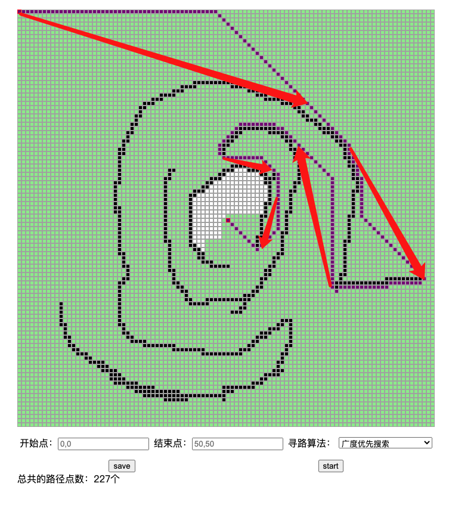

# 学习笔记

记录下作业遇到的坑

## 寻路

- 二叉堆的难点主要是在插入和删除的地方，学习参考[视频](https://www.youtube.com/watch?v=t0Cq6tVNRBA&index=5&t=0s&list=PLLXdhg_r2hKA7DPDsunoDZ-Z769jWn4R8)
- 貌似最优路径并不是最短路径，如何求最短路径是个问题。

对第三点不是最短路径问题，在广搜的路径点数为227个，如下图： 
 

a star 搜索路径点数为252个，如下图：  

a star 寻路并不是最短路径。然而还有
理想状况下的最短路径，如下图用红线标识，如下图：
  
不太知道这样的最短路径应该怎么做。